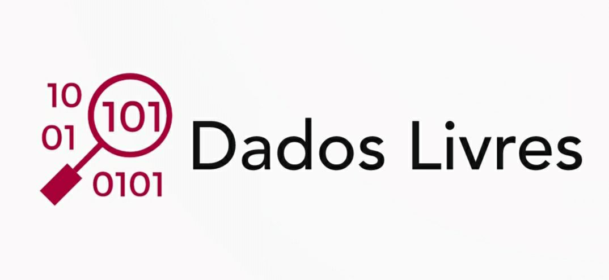

# Página Estática da Plataforma Dados Livres

Plataforma Livre de Dados Abertos Governamentais: [Dados Livres](dadoslivres.org)

## Principais características de Dados Livres:

* Encontrar fontes de dados e softwares separados por categorias
* Colaborar e navegar por diversas fontes de dados e softwares
* Ver relações de fontes de dados com softwares cadastrados

## Repositórios oficiais do projeto:
[Link no GitHub](https://github.com/pbaesse/plataforma-livre-dados-abertos)

[Link no GitLab](https://gitlab.com/pbaesse/dados-livres) (atualmente atualizado!)

## Logo provisória do projeto:

